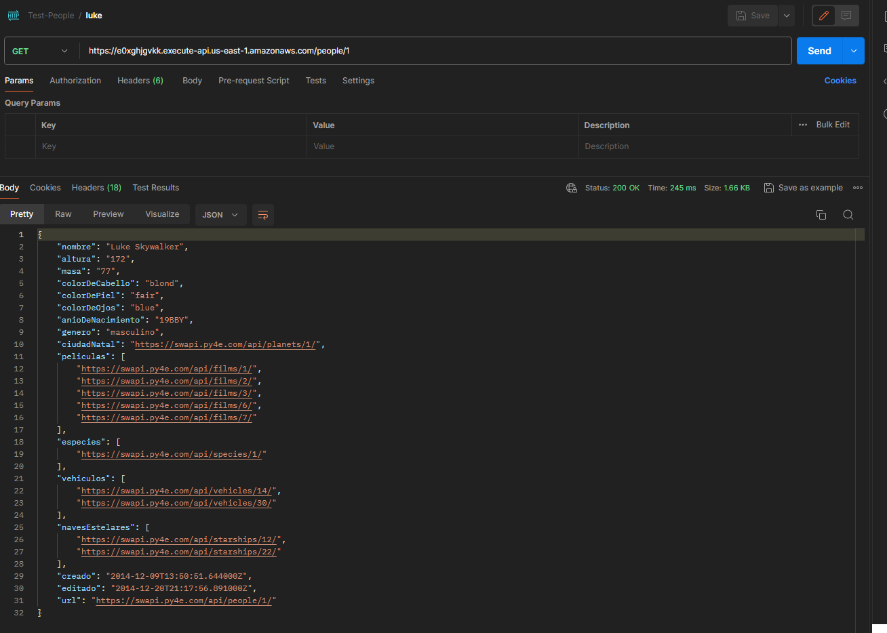
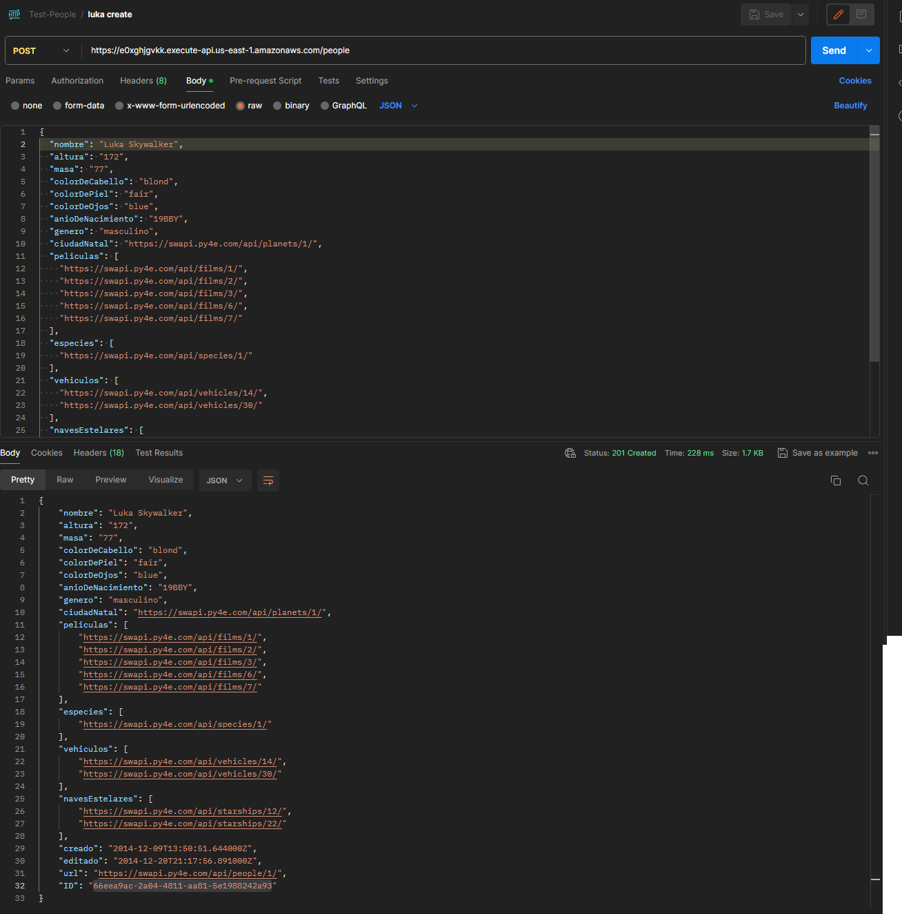
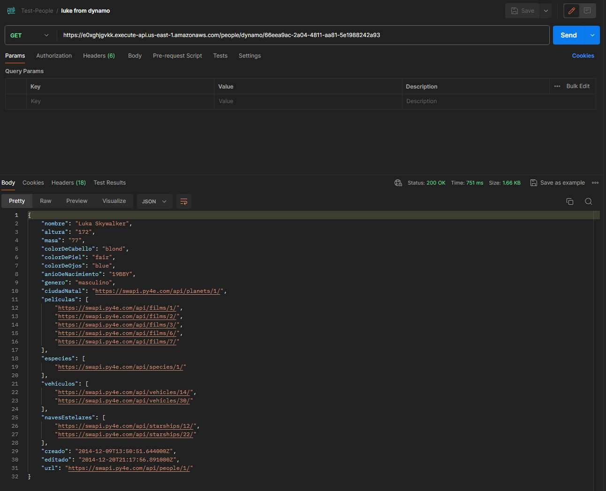

# Descripción del reto técnico #

- [x] Crear una API en Node.js con el framework Serverless para un despliegue en AWS

- [x] Adaptar y transformar los modelos de la API SWAPI a español, es decir tienen que mapear todos los nombres de los atributos del inglés al español. Ejemplo: { “name” : “Luke”} cambiar a {“nombre” : ”Luke”}.

- [x] Integrar la API de prueba StarWars API (líneas abajo está el link) se deben integrar uno o más endpoints.

- [x] Crear un modelo de su elección mediante el uso de un endpoint POST, la data se tendrá que almacenar dentro de una base de datos.

- [x] Crear un endpoint GET que muestre la data almacenada.

- API de prueba SWAPI: [SWAPI](https://swapi.py4e.com/documentation)

# Puntos mínimos-obligatorios del MVP #

- [x] Mínimo 2 endpoints, GET para recuperar la información y PST para crear un elemento

- [x] Integración con una base de datos (DynamoDB o MySQL)

- [x] Integración con SWAPI

- [x] Traducción de atributos de inglés a español

- [x] Uso de Serverless Framework

- [x] Uso de Node.js

- [x] Respeto de las buenas prácticas de desarrollo

# Puntos Bonus #

- [x] Pruebas unitarias
- [x] Uso de TypeScript
- [x] Documentación de uso
- [ ] Documentación en Open API/Swagger
- [x] Desplegar sin errores en AWS con el comando deploy del framework serverless
- [x] Mayor complejidad de Integración
- [x] Uso de un framework
- [x] Trabajar en capas y por dominio

# Requirements #

```shell
    node 16 +
```

```shell

    # aws cli v2 installed
    aws configure 

```


```shell

  SWAPI_BASE_URL="https://swapi.py4e.com/api/"
  TEST_PEOPLE_TABLE="TEST_PEOPLE_TABLE"
  ENV="DEV"
  PORT="3000"

```

```shell

  #clonar el repositorio
  git clone https://github.com/luizarnoldch/aws-node-test-evaluation.git
  
```

# Despliegue #

Instalación de dependencias

```shell

    npm i || npm i --legacy-peer-deps

    npm install -g npm@latest (opcional)
    npm install -g serverless (opcional)
    npm install serverless-esbuild@latest --save-dev (opcional)

```

Depiegue

```shell

    # local
    npm run deploy:dev

    # aws
    npm run deploy

```

# Desarollo #

Ejecución de dynamoLocal

```shell

    npm i || npm i --legacy-peer-deps

    # instalar docker cli o en terminal
    # make
    make dynamo-up

```

Ejecución de Express como framework

```shell

    npm run dev

```

# Testing #

Ejecución de dynamoLocal

```shell

    npm i || npm i --legacy-peer-deps
    
    # instalar docker cli o en terminal
    # make
    make dynamo-up

```

Ejecución del testing unitario y de integración

```shell

    npm run test

```

# Endpoints #

## Get People from SWAPI

Este endpoint recupera una persona por ID de SWAPI.



### HTTP Request

`GET /people/:id`

### URL Parameters

| Parameter | Description        |
|-----------|--------------------|
| id        | ID de la persona   |

### Respuesta Exitosa

- **Código:** 200
- **Contenido:** `{ nombre: "Luke Skywalker", ... }`

## Post People from SWAPI

Este endpoint envia la información de una persona y la guarda en DynamoDB



### HTTP Request

`POST /people`

- **body:** 

`{
  "nombre": "Luka Skywalker",
  "altura": "172",
  "masa": "77",
  "colorDeCabello": "blond",
  "colorDePiel": "fair",
  "colorDeOjos": "blue",
  "anioDeNacimiento": "19BBY",
  "genero": "masculino",
  "ciudadNatal": "https://swapi.py4e.com/api/planets/1/",
  "peliculas": [
    "https://swapi.py4e.com/api/films/1/",
    "https://swapi.py4e.com/api/films/2/",
    "https://swapi.py4e.com/api/films/3/",
    "https://swapi.py4e.com/api/films/6/",
    "https://swapi.py4e.com/api/films/7/"
  ],
  "especies": [
    "https://swapi.py4e.com/api/species/1/"
  ],
  "vehiculos": [
    "https://swapi.py4e.com/api/vehicles/14/",
    "https://swapi.py4e.com/api/vehicles/30/"
  ],
  "navesEstelares": [
    "https://swapi.py4e.com/api/starships/12/",
    "https://swapi.py4e.com/api/starships/22/"
  ],
  "creado": "2014-12-09T13:50:51.644000Z",
  "editado": "2014-12-20T21:17:56.891000Z",
  "url": "https://swapi.py4e.com/api/people/1/"
}
`

(this information is on postman)

### Respuesta Exitosa

- **Código:** 200
- **Contenido:** `{ nombre: "Luke Skywalker", ... }`

## Get People from DynamoDB

Este endpoint recupera una persona por ID de DynamoDB.



### HTTP Request

`GET /people/dynamo/:id`

### URL Parameters

| Parameter | Description        |
|-----------|--------------------|
| id        | ID de la persona   |

### Respuesta Exitosa

- **Código:** 200
- **Contenido:** `{ ID: "uuid", nombre: "Luke Skywalker", ... }`
